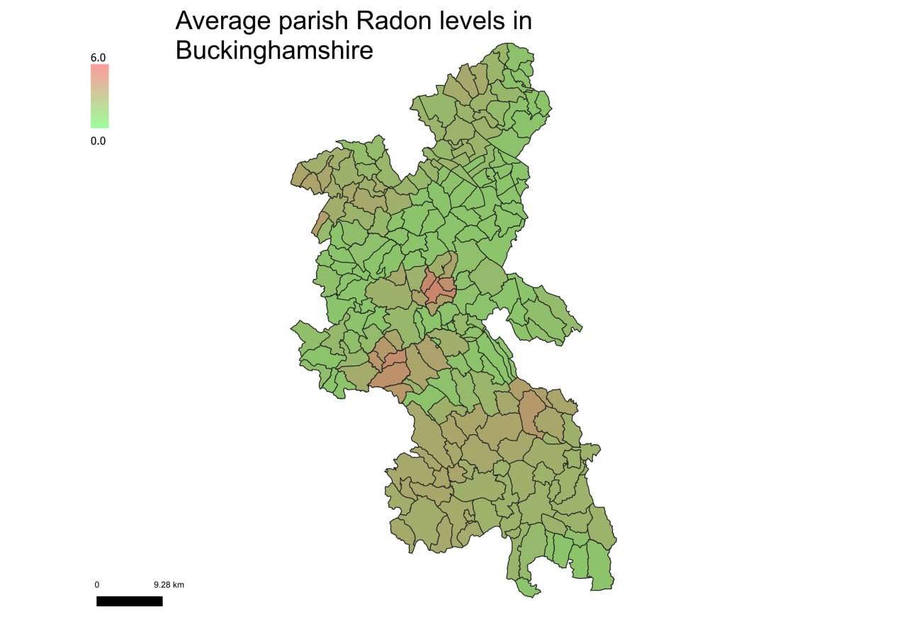

# Radon Parish Mapping Tool

A QGIS‑based Python script that reprojects geospatial data, computes area‑weighted mean radon levels for each parish, and generates styled county‑wise map layouts automatically.

## Overview

This tool processes geographic data for Greater London (or any area with a similar structure) and performs the following steps:

1. **Reprojection**  
   - Reads all `.gpkg` and `.mbtiles` files from an input folder.  
   - Reprojects every layer to **EPSG:27700** (British National Grid).  
   - For MBTiles, `ogr2ogr` is used (requires GDAL).  
   - Outputs reprojected layers to a separate folder.

2. **Spatial Analysis**  
   - Loads three specific layers (parishes, radon atlas, ceremonial county boundaries).  
   - Computes for each parish the **area‑weighted average** of the `CLASS_MAX` field from intersecting radon polygons.  
   - Stores the result in a new `mean_radon` attribute.

3. **Visualisation**  
   - Applies a **graduated symbol renderer** (Jenks natural breaks, 100 classes) with a green‑to‑red colour ramp.  
   - Creates a print layout for each ceremonial county:  
     - Masks out the county area to focus on parishes.  
     - Adds a continuous gradient legend (workaround for vector layers), scale bar, title, and map.  
     - Exports a high‑resolution PNG image.

4. **Performance**  
   - Uses a spatial index for fast radon‑parish intersections.  
   - Batches attribute updates to the parish layer.  
   - Progress logging and time measurement.

## Requirements

- **QGIS 3.x** (with Python 3) – the script uses `qgis.core`, `qgis.PyQt`, and `processing`.  
- **GDAL** (for `ogr2ogr` when handling MBTiles).  
- Python libraries: `os`, `time`, `subprocess` (all standard).

Ensure that the QGIS Python environment is activated (e.g. by running the script from the QGIS built‑in Python console or with `pyqgis`‑aware launcher).

## Folder Structure
